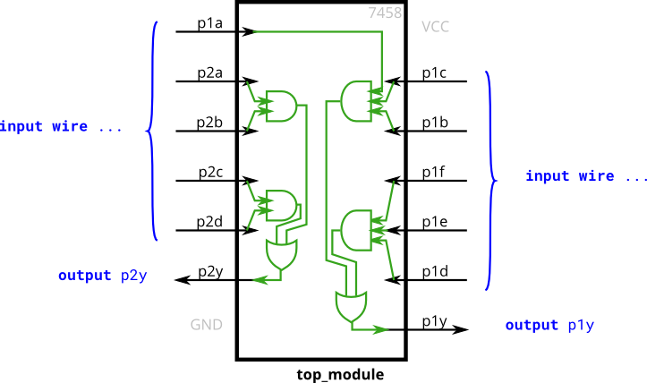
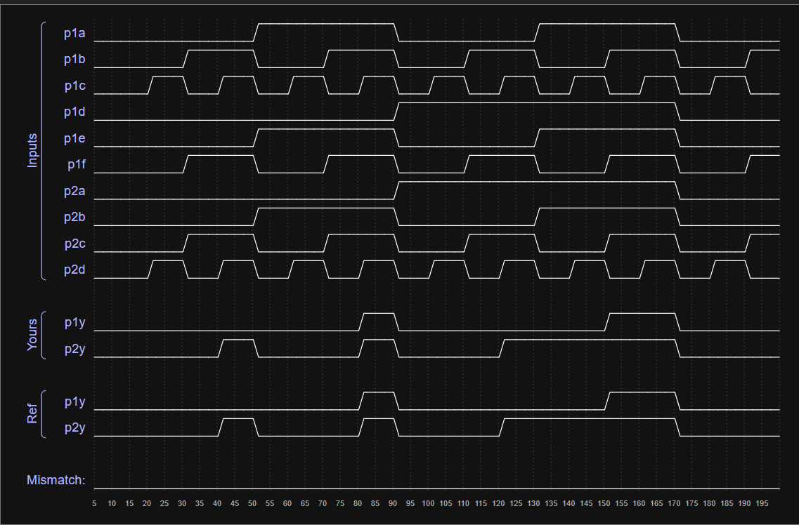

# 7458 Dual AND-OR Gate Logic Implementation

This module implements the internal logic of the **7458 Integrated Circuit**, which consists of multiple AND gates feeding into OR gates. The design focuses on structural integrity and clear signal routing, aligning with **Security-by-Design** principles.

## 💡 Design Philosophy

* **Structural Clarity**: I used explicit internal `wire` declarations to mirror the physical layout of the 7458 chip, making the design easier to audit and verify.
* **Architectural Robustness**: Prioritizing readable and systematic naming conventions (e.g., `p1_abc_and`) to minimize human error during complex logic integration.
* **Verification**: The module was verified against golden reference models using timing simulations to ensure zero-mismatch performance.

## 🏗️ Schematic

The following diagram illustrates the internal logic flow of the 7458 chip as implemented in this module:

## 📊 Simulation Results (Waveforms)

The timing diagram below confirms that my implementation (`Yours`) perfectly matches the reference signals (`Ref`) across various input combinations.

## 🛠️ Technical Details

* **Language**: Verilog
* **Tools**: VS Code
* **Key Concepts**: 
  * Continuous assignment (`assign`)
  * Internal signal routing via `wire`
  * Bitwise logical operators