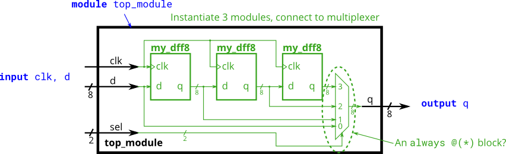
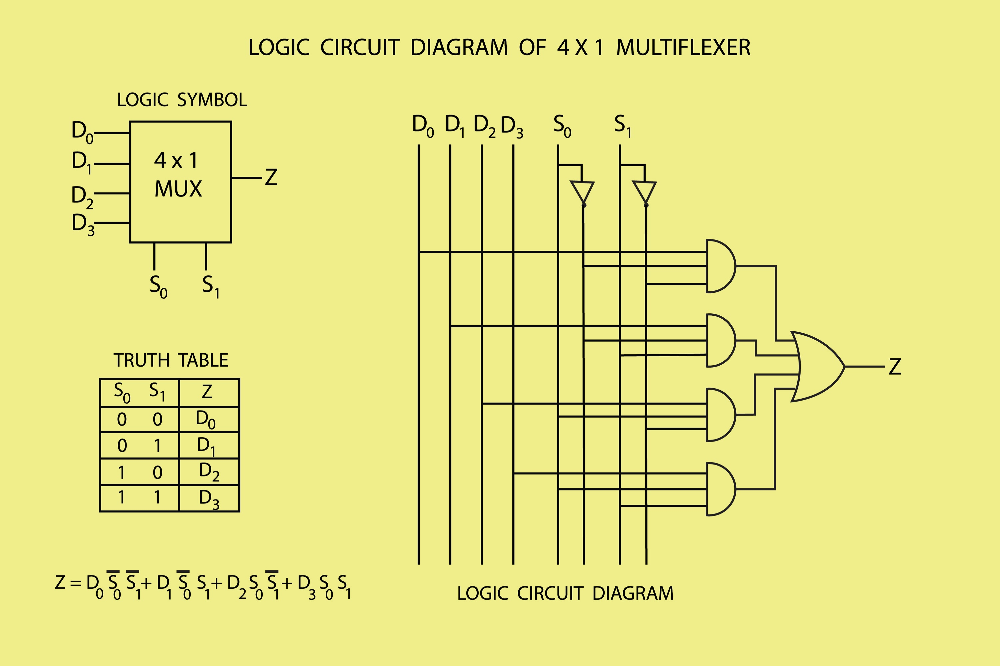

# 8-Bit Shift Register with Delay Selector

## Overview
This repository contains the Verilog implementation of an 8-bit wide shift register combined with a 4-to-1 multiplexer (MUX). The design emphasizes hierarchical hardware architecture by chaining multiple 8-bit D Flip-Flop modules to create a sequential delay line, while utilizing combinational logic to dynamically select the output state.

## System Architecture
The top module integrates two main digital design paradigms:
* **Sequential Logic (Shift Register):** Three instances of an 8-bit D-type Flip-Flop (`my_dff8`) are chained together. This creates a pipeline where the input data (`d`) is delayed by one clock cycle per stage.
* **Combinational Logic (4-to-1 MUX):** A purely combinational multiplexer safely routes the data without inferring unwanted latches or causing multiple driver conflicts. Based on a 2-bit select signal (`sel`), the system outputs either the immediate input or one of the delayed stages.

## Port Description
* `clk` (Input): System clock.
* `d` (Input, 8-bit): Data input vector.
* `sel` (Input, 2-bit): Selector signal to choose the delay cycle (0 to 3).
* `q` (Output, 8-bit): Final output vector based on the selected delay.

## Circuit Diagrams
You can find the visual representations of the logic flow and architecture in the `utils/` directory:

## Key Design Principles Applied
* **Hierarchical Design:** Complex logic is divided into smaller, manageable sub-modules (instantiation by name).
* **Width Mismatch Prevention:** Strict vector sizing (`[7:0]`) across all intermediate wires.
* **Safe Combinational Blocks:** Proper use of `always @(*)` to prevent unintended memory allocation (latches) and hardware short-circuits (multiple drivers).